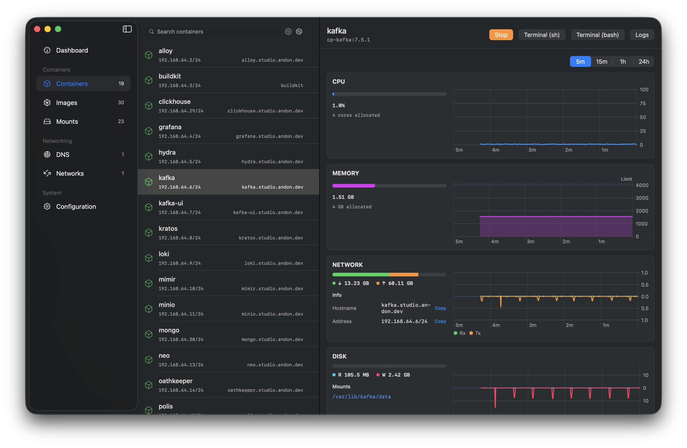
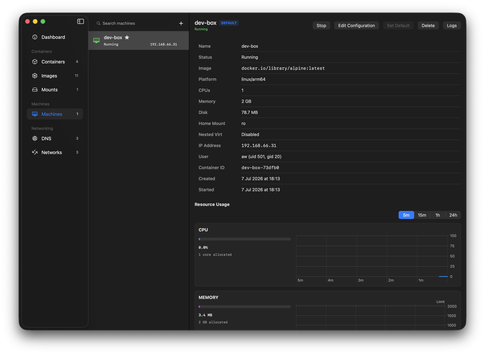
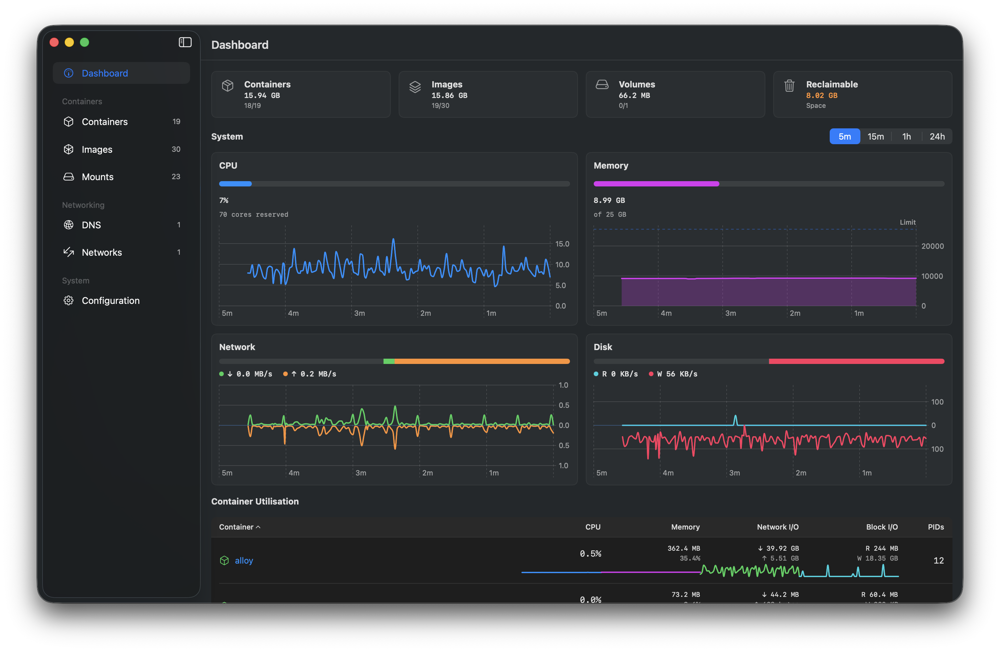
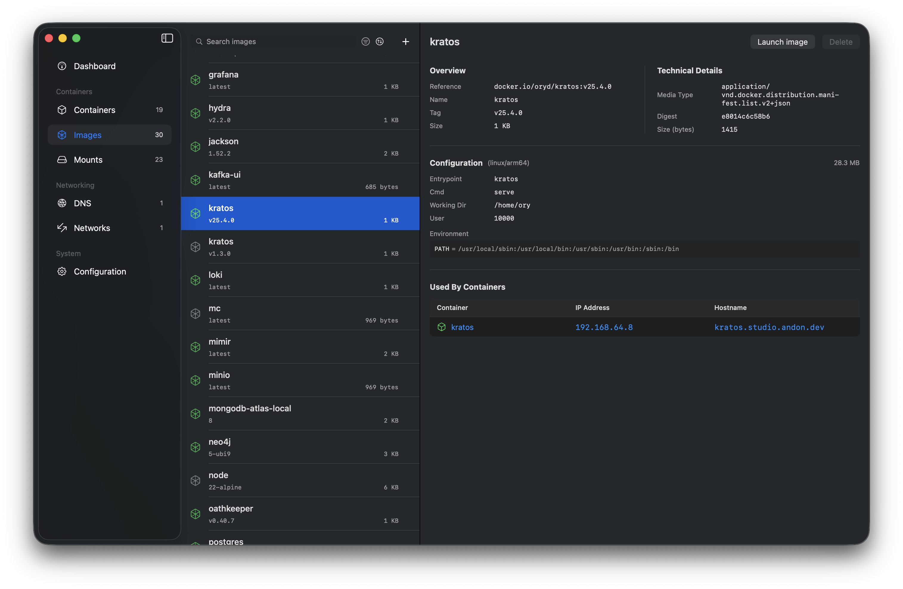
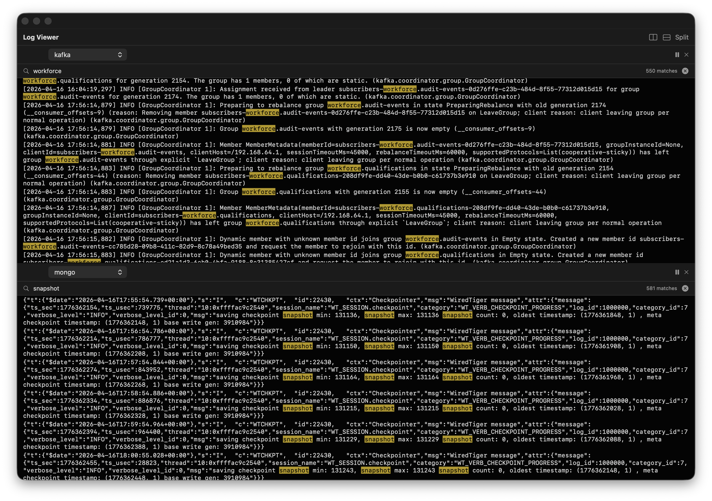
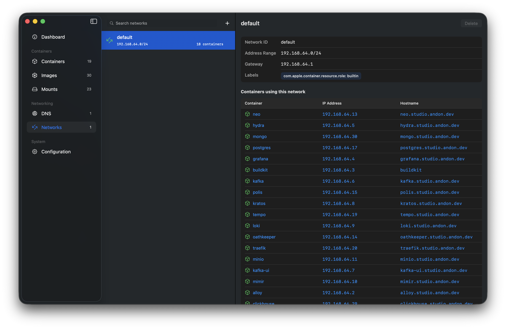
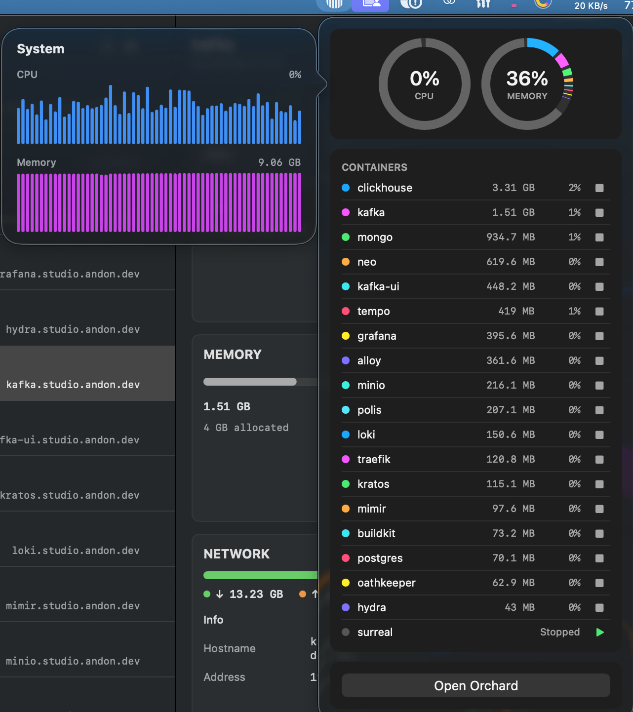

[](https://github.com/andrew-waters/orchard/stargazers)
[](https://formulae.brew.sh/cask/orchard)
[](https://formulae.brew.sh/cask/orchard)
[](LICENSE)
[](https://github.com/andrew-waters/orchard/actions/workflows/ci.yml)
[](https://github.com/andrew-waters/orchard/actions/workflows/ci.yml)

```bash
brew install orchard
```

[See all install options](#installation)

---

Orchard is a native (Swift) macOS application for managing containers, machines and local AI models using Apple's [container](https://github.com/apple/container) tooling.

It gives you a desktop experience that complements the `container` command-line interface.

Hundreds of installations and starred by engineers from Apple, Microsoft, Red Hat, GitHub & more - [see who's adopting Orchard](#adoption)  

---

- [Local AI & Sandboxes](#local-ai--sandboxes)
- [Container Machines](#container-machines)
- [Benefits of Apple Containers](#benefits-of-apple-containers)
- [Orchard Features](#orchard-features)
- [How Orchard compares](#how-orchard-compares)
- [Requirements](#requirements)
- [Architecture](#architecture)
- [Installation](#installation)
  - [Homebrew](#homebrew)
  - [Release download](#release-download)
  - [Build from Source](#build-from-source)
- [Adoption](#adoption)
- [Star History](#star-history)
- [License](#license)



## Local AI & Sandboxes

Orchard wires **local MLX models** into Apple containers. Inference runs on your Mac's GPU (container VMs have no GPU access) and containers reach it with no hand-configured networking.


- Discover model servers already on your Mac (Ollama, LM Studio, MLX servers), or start and stop `mlx_lm.server` instances from the app - with process supervision, crash surfacing and logs
- The container↔model bridge: Orchard computes the container-reachable endpoint from the network gateway and injects `OPENAI_BASE_URL` at create time, so containerised apps just use the OpenAI SDK
- **Sandboxes**: a first-class view of containers wired to a local model - isolation badge (host-only vs internet-open), chat and terminal access, and a kill-switch. Run an agent behind a hypervisor boundary with a local endpoint instead of an API key it could leak
- An in-app chat tester to verify any model server without leaving the app

See the [Local AI guide](https://orchard.andon.dev/ai.html) for a full walkthrough and a runnable quick start.

## Container Machines

Orchard manages Apple **container machines** natively: persistent, stateful Linux VMs you can create, configure, run and monitor without leaving the app or dropping to the CLI.



- Create machines from any init-capable image, with CPU, memory, home-mount, nested-virtualization and custom-kernel options
- Start, stop, set-default and delete, plus a one-click stop / apply / restart configuration editor
- Live CPU, memory, network and disk usage, in the machine view and on the dashboard
- Output and boot logs in the same multi-pane log viewer as containers
- Guardrails that warn before creating from an image with no init system, and explain a machine that stopped because of it

Machines are driven over Apple's native XPC API (`MachineAPIClient`), not by shelling out. See the [Container Machines guide](https://orchard.andon.dev/machines.html) for a full walkthrough and the pitfalls to avoid.

## Benefits of Apple Containers

- Native support, incredible performance and the engineering resources to make it work.
- Sub second startup times
- Kernel isolation by design
- Easier networking - no more port mapping (every container gets its own IP address), networks out of the box

## Orchard Features

- Local AI: discover or run MLX model servers, bridge containers to them, and manage agent sandboxes with isolation badges and a kill-switch
- Container machines: create, configure, run and monitor persistent Linux VMs over native XPC
- Container management: create, start, stop, force stop, delete
- Image management: pull, delete, search Docker Hub
- Network and DNS domain management
- Real-time container stats with sortable columns
- Sortable container and image lists with persistent preferences
- Multi-container log viewer with split panes, filtering, and per-container colour coding
- Container log viewer with search highlighting
- Builder, kernel and system property management
- Menu bar integration



A system-wide dashboard - the default view when the app opens - summing CPU, memory, network, and disk across every container, with headline disk-usage tiles and a per-container utilisation table with live sparklines.



Browse, pull, and delete container images. Search Docker Hub directly from the app and inspect image metadata without dropping to the CLI.



Stream logs from multiple containers side by side. Split panes, filter by text, and use per-container colour coding to keep output readable when debugging across services.



Manage networks and DNS domains without touching the CLI - see every container's IP address and hostname at a glance, set the default DNS domain, and create or remove domains and networks.



Keep an eye on things from the menu bar: CPU and memory usage rings across all running containers, a per-container list with start/stop controls, and one-click access back to the app.

## How Orchard compares

Orchard isn't the only way to work with Apple's `container` runtime:

| Capability | Orchard | Podman Desktop | `container` CLI |
| :-- | :--: | :--: | :--: |
| Purpose-built for `apple/container` | ✅ | ➖ <sup>1</sup> | ✅ |
| Native macOS app | ✅ <sup>2</sup> | ❌ <sup>3</sup> | ❌ |
| Native XPC integration (no CLI shelling) | ✅ | ❌ <sup>4</sup> | ✅ |
| Container machines (native XPC) | ✅ | ❌ | ✅ |
| Local AI models & agent sandboxes | ✅ | ❌ | ❌ |
| Signed & notarized | ✅ | ✅ | ✅ |
| Multi-pane log viewer | ✅ | ➖ | ➖ <sup>5</sup> |
| Live container stats (CPU/mem/net/disk) | ✅ | ✅ | ➖ |
| Network, DNS & builder management | ✅ | ➖ | ✅ |
| Focused, lightweight footprint | ✅ | ❌ <sup>6</sup> | ✅ |
| Open source | ✅ <sup>7</sup> | ✅ <sup>8</sup> | ✅ <sup>8</sup> |

<sup>✅ full support · ➖ partial or indirect · ❌ not available</sup>

1. Supported through a community extension, not natively.
2. Native Swift / SwiftUI.
3. Built on Electron.
4. Talks to a Docker-API shim rather than the native XPC API.
5. Terminal output only - no multi-pane viewer.
6. General-purpose, multi-runtime tool.
7. MIT licensed.
8. Apache-2.0 licensed.

Orchard is the **native, purpose-built** choice: a lightweight Swift app focused solely on giving Apple's `container` a first-class desktop experience, rather than a heavyweight cross-platform tool that supports it as one runtime among many. (Note: Docker Desktop is a separate container runtime and doesn't manage `apple/container`.)

Being native goes beyond the UI: Orchard talks to the container daemon over the same typed XPC API the `container` CLI uses internally, rather than spawning the CLI and parsing its output. That means structured data instead of screen-scraping (no breakage when CLI wording changes), no child processes on every refresh, real log streams feeding the multi-pane viewer, and typed errors instead of exit codes.

## Requirements

- macOS 26 (Tahoe)
- Xcode 26 / Swift 6.2 (for building from source)
- [Apple Container](https://github.com/apple/container) installed - [follow the instructions here](https://github.com/apple/container?tab=readme-ov-file#install-or-upgrade)

## Architecture

Orchard communicates with the container daemon primarily through the `ContainerAPIClient` Swift library (from [apple/container](https://github.com/apple/container)) over XPC - typed Swift APIs for containers, images, networks, stats, logs, and system health, with no CLI process spawning or output parsing on this path. Every operation the API exposes goes over XPC; the remaining CLI-backed operations are the exceptions noted below.

A small number of operations still use the `container` CLI via `Foundation.Process`, each for a structural reason rather than convenience: system start/stop/restart (the daemon is registered with launchd - there is nothing to XPC to until it's running), builder lifecycle (the API exposes no builder surface; the CLI orchestrates it client-side), system properties (a local defaults store, not an API), DNS domain create/delete (requires root, so it runs the CLI under administrator privileges), and kernel selection (installing the recommended kernel provisions it - an operation the API doesn't expose as a single call).

## Installation

You can install Orchard via homebrew or via a prebuilt release package. You can also download the source and build it yourself!

> Every release is **code-signed with a registered Apple Developer ID and notarized by Apple**, so it installs and launches cleanly with no Gatekeeper "unidentified developer" warning.

### Homebrew

```bash
brew install orchard
```

### Release download

1. Download the latest release from [GitHub Releases](https://github.com/andrew-waters/orchard/releases)
2. Open the `.dmg` file and drag Orchard to your Applications folder
3. Launch Orchard from the Apps directory

### Build from Source

```bash
git clone https://github.com/andrew-waters/orchard.git
cd orchard
open Orchard.xcodeproj
```

The project uses Swift Package Manager for dependencies. Xcode will resolve the `apple/container` package automatically on first build.

## Adoption

Orchard is installed hundreds of times a month via Homebrew - see the live [install stats](https://formulae.brew.sh/cask/orchard) - and has been starred by engineers from Apple, Microsoft, GitHub, Red Hat, Amazon, MongoDB, Tencent and across the wider cloud-native community.

Using Orchard at your company or in your day-to-day workflow? We'd love to hear about it - add yourself to [`ADOPTERS.md`](ADOPTERS.md) with a quick pull request.

## Star History

<a href="https://www.star-history.com/?repos=andrew-waters%2Forchard&type=date&legend=bottom-right">
 <picture>
   <source media="(prefers-color-scheme: dark)" srcset="https://api.star-history.com/chart?repos=andrew-waters/orchard&type=date&theme=dark&legend=bottom-right&sealed_token=QHFno-cQk7RLm2jSGqr6nMSnR_x3VQtYBnaXOz-HIQbtG8lrwoY7dsfXa1lwdB-ORWpMSKAUn9lQMsOybZS-umz8X_ge0_BWlPUJ86XKnHQLBAav3XE2oMEEALRJXJVQAM0LfY9ChMtnYx7WZqlRgAtMSyGS72iZEa5Nej6XbIuZ-Y-9l4SLBRe7-4-U" />
   <source media="(prefers-color-scheme: light)" srcset="https://api.star-history.com/chart?repos=andrew-waters/orchard&type=date&legend=bottom-right&sealed_token=QHFno-cQk7RLm2jSGqr6nMSnR_x3VQtYBnaXOz-HIQbtG8lrwoY7dsfXa1lwdB-ORWpMSKAUn9lQMsOybZS-umz8X_ge0_BWlPUJ86XKnHQLBAav3XE2oMEEALRJXJVQAM0LfY9ChMtnYx7WZqlRgAtMSyGS72iZEa5Nej6XbIuZ-Y-9l4SLBRe7-4-U" />
   
 </picture>
</a>

## License

This project is licensed under the MIT License - see the [LICENSE](LICENSE) file for details.
